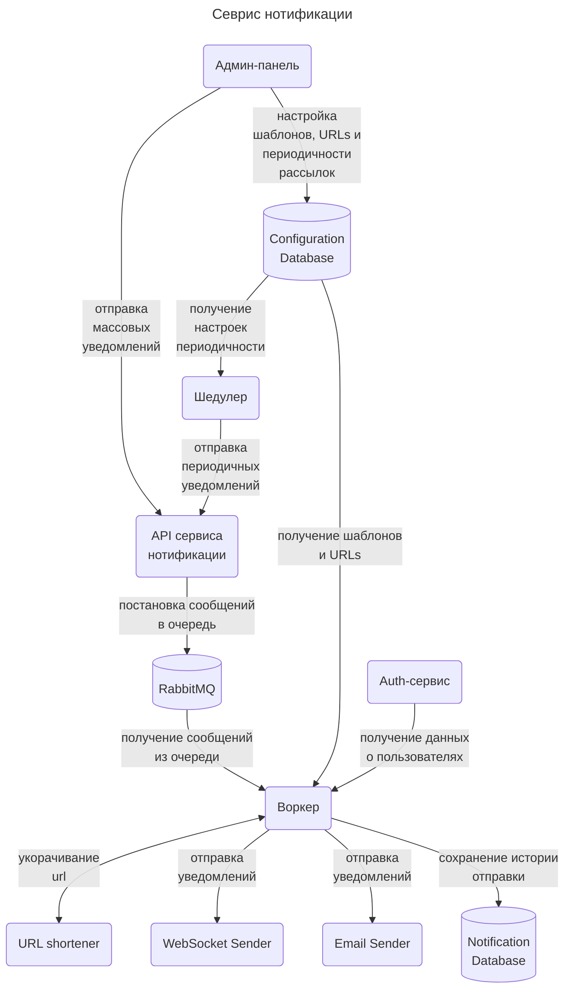

```mermaid
---
title: Севрис нотификации
---
flowchart
    admin(Админ-панель)
    scheduler(Шедулер)
    api(API сервиса\nнотификации)
    worker(Воркер)
    ws(WebSocket Sender)
    config_db[(Configuration\nDatabase)]
    notif_db[(Notification\nDatabase)]
    rabbit[(RabbitMQ)]
    auth(Auth-сервис)
    email(Email Sender)
    short(URL shortener)

admin -->|настройка\nшаблонов, URLs и\nпериодичности\nрассылок| config_db
config_db -->|получение\nнастроек\nпериодичности| scheduler
admin -->|отправка\nмассовых\nуведомлений| api
scheduler -->|отправка\nпериодичных\nуведомлений| api
api -->|постановка сообщений\nв очередь| rabbit
rabbit -->|получение сообщений\nиз очереди| worker
config_db -->|получение шаблонов\nи URLs| worker
auth -->|получение данных\nо пользователях| worker
worker <-->|укорачивание\nurl| short
worker -->|отправка\nуведомлений| ws
worker -->|отправка\nуведомлений| email
worker -->|сохранение истории\nотправки| notif_db
```