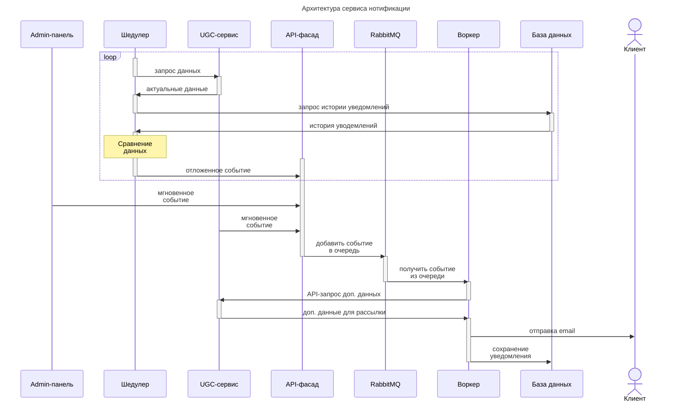

```mermaid
---
title: Архитектура сервиса нотификации
---
sequenceDiagram
    participant admin as Admin-панель
    participant sch as Шедулер
    participant ugc as UGC-сервис
    participant api as API-фасад
    participant mq as RabbitMQ
    participant worker as Воркер
    participant db as База данных
    actor client as Клиент

    loop
    activate sch
    sch ->> ugc: запрос данных
    deactivate sch
    activate ugc
    ugc ->> sch: актуальные данные
    deactivate ugc
    activate sch
    sch ->> db: запрос истории уведомлений
    deactivate sch
    activate db
    db ->> sch: история уводемлений
    deactivate db
    activate sch
    Note over sch: Сравнение<br />данных
    activate api
    sch ->> api: отложенное событие
    deactivate sch
    end
    
    admin ->> api: мгновенное<br />событие
    ugc ->> api: мгновенное<br />событие
    api ->> mq: добавить событие<br />в очередь
    deactivate api
    activate mq
    mq ->> worker: получить событие<br />из очереди
    deactivate mq
    activate worker
    worker ->> ugc: API-запрос доп. данных
    deactivate worker
    activate ugc
    ugc ->> worker: доп. данные для рассылки
    deactivate ugc
    activate worker
    worker ->> client: отправка email
    worker ->> db: сохранение<br />уведомления
    deactivate worker

```
