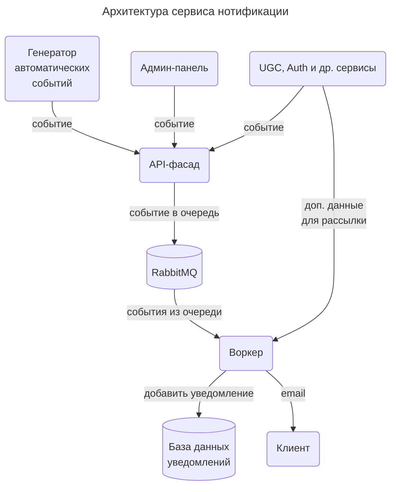
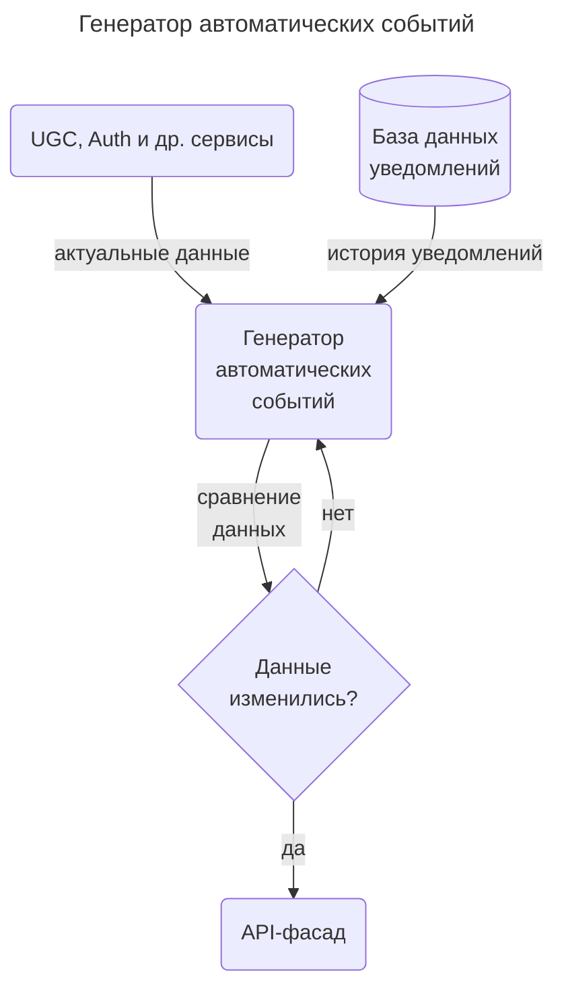

```mermaid
---
title: Архитектура сервиса нотификации
---
flowchart
    service(UGC, Auth и др. сервисы)
    admin(Админ-панель)
    generator(Генератор\nавтоматических\nсобытий)
    api(API-фасад)
    mq[(RabbitMQ)]
    worker(Воркер)
    db[(База данных\nуведомлений)]
    client(Клиент)
    
    generator -->|событие| api
    admin -->|событие| api
    service -->|событие| api

    api -->|событие в очередь| mq
    mq -->|события из очереди| worker
    service -->|доп. данные\nдля рассылки| worker
    worker -->|добавить уведомление| db
    worker -->|email| client
```

```mermaid
---
title: Генератор автоматических событий
---
flowchart
    service(UGC, Auth и др. сервисы)
    generator(Генератор\nавтоматических\nсобытий)
    api(API-фасад)
    db[(База данных\nуведомлений)]
    q{Данные\nизменились?}
    
    generator -->|сравнение\nданных| q
    service -->|актуальные данные|generator
    db -->|история уведомлений| generator
    q -->|да| api
    q -->|нет| generator
     
```